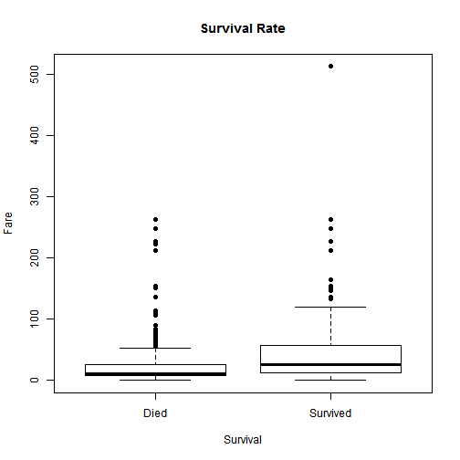

## Objective

My initial objective was to create a visualization tool for classification data sets with a binary output.

I was going to use ggplot2 to create informative charts based on the type of the predictor variable (number, factor, etc)

<b>BUT</b>, it turns out that even if you write perfectly working R code, it does not mean you can get it to run on shiny.

So, after several iterations of reducing scope, I ended up creating a simple plotting tool for the Titanic data set provided by Kaggle. 

--- .class #id 

## App Description

The simple shiny shows the distribution of the predictor for those who survived and those who died.


1. Load the Titanic data set from the Kaggle Competition
2. The user chooses a predictor from the shiny UI
3. Create a simple plot showing how the predictor is distributed for the survivors and the dead

--- .class #id 

## Preparing the Data

Here is a code snippet that loads the data. This code executes once when the server runs


```r
data <- read.csv("train.csv")

cdata <- 
    data.frame(Survived=data$Survived, 
               Pclass=data$Pclass,
               Sex = data$Sex,
               Age = data$Age, 
               Fare = data$Fare, 
               Embarked = data$Embarked)

cdata$Survived <- as.factor(ifelse(cdata$Survived==0,'Died','Survived'))
cdata$Pclass <- as.factor(cdata$Pclass)
```

--- .class #id 

## Sample Plot

Here is a sample of the plots created

 


--- .class #id 


## Conclusion

In conclusion, there is no reason to waste more time learning shiny. 
Creating an app seems deceptivly simple, but getting the app to do what you want is an exercise in frustration.

It is much better to invest time learning a proper Javascript package for interactive charts.

Slidify is pretty cool though.
